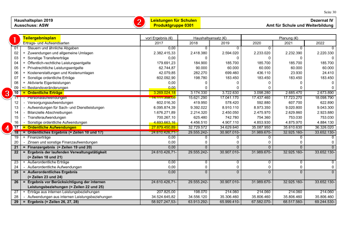

# Haushalt Münster

## How to scrape data

### Requirements

Basics:

- A working Python 3 installation
- [pdfquery package](https://github.com/jcushman/pdfquery) for Python
- 4 GB of RAM or more and a modern CPU: A 600 page document requires several minutes and about 2.5GB in total during runtime, if processing is split into 3 simultaneous processes via `multiprocessing` (tested on a computer with Intel Core i5 6500, 16GB RAM, Windows 7 x64 and Python 3.6)

### Configure yourself an environment with Python and virtualenv

Run these commands in the cloned Git directory:

```
virtualenv venv
venv\Scripts\activate
pip install pdfquery
```

#### Patch pdfquery or wait a while

pdfquery unfortunately has a [bug](https://github.com/jcushman/pdfquery/issues/67) that limits caching with a page `range()` (exact details to be determined). You can remove caching from the script (multiple runs on the same PDF will be slow), cut down your PDFs to just tables, or apply [this patch](pdfquery.patch) (for pdfquery 0.4.3 from pip) which changes the naming of cache files.

### Run the script

Download data from Stadt Münster website: [stadt-muenster.de - Münsters Haushalt](https://www.stadt-muenster.de/finanzen/muensters-haushalt/der-haushaltsplan.html)

Insert the PDF filename into haushaltescraper.py at the bottom and change the page numbers list:

```
pdf_filename = "input/Band_2_HPL_2014.pdf" # 796 pages
out_filename = "output/ergebnis-2012-complete.csv"
# pagelist is 0-indexed
pagelist = [list(range(0,200)), list(range(200,400)), list(range(400,765))]
```

Run the script:

```
python haushaltescraper.py
```

The output will be written to a CSV file specified in `out_filename` (see above).

## How the scraper works

The script tries to identify text in various regions of each PDF page.

See this illustration:



1. Each table is labelled "Teilergebnisplan" in the top left corner, if this text is not found then skip the page
2. Each page contains a heading which should include "Produktgruppe <4 numbers>" and its meaning, if the number is not found skip the page
3. If conditions 1 and 2 match then find the text "= Ordentliche Erträge", store its y coordinates (page contents can shift slightly) and grab the value
4. Same as 3 with the text "= Ordentliche Aufwendungen"
